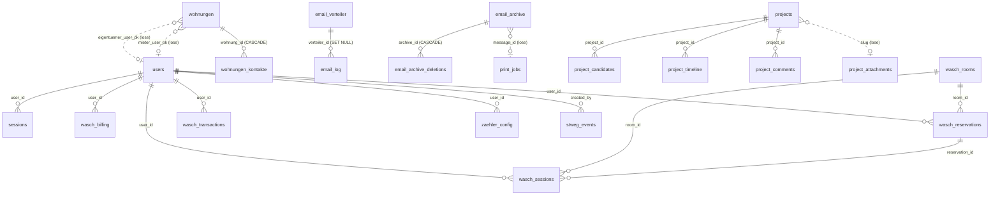

# Datenbank-Layout

PostgreSQL-Datenbank `rosenweg` (Container `rosenweg_postgres`, Port 5432).
Energie-Daten leben in separater DB `rosenweg_energy` auf dem gleichen Cluster.

## Übersicht (ER-Diagramm)



`||--o{` = harte Foreign-Key-Verknüpfung
`}o..o|` = lose Verknüpfung (kein DB-FK, nur Spalten-Konvention)

## Domänen

### Identity & Zugriff

```
users (Authentik-Cache)
  id (PK), email, name, groups_json (JSONB), active, created_at
```

`groups_json` enthält die Authentik-Gruppen (z.B. `["Technik", "stweg3-eigentuemer"]`),
periodisch via `syncKontakteToAuthentik` synchronisiert.

```
sessions
  id (PK), user_id (FK→users.id), token, expires_at

permissions
  id (PK), page, group_name, can_read, can_write
```

`permissions` wird vom Backend geladen und im `requirePermission(page, op)`-Middleware geprüft.

### Verwaltung (Wohnungseigentum)

```
wohnungen
  id (PK), stweg (1-8), bezeichnung (z.B. "RW3-EG.1", "P12"),
  typ (Wohnung | Parkplatz | Hobbyraum),
  stockwerk, zimmer, flaeche_m2,
  wertquote_zaehler, wertquote_nenner (default 1000),
  bewohnt_von (eigentuemer | mieter),
  besonderheiten, notizen, waschkueche_berechtigt,
  eigentuemer_user_pk*, mieter_user_pk*  (legacy lose FK auf users.id)

wohnungen_kontakte (FK wohnung_id → wohnungen.id ON DELETE CASCADE)
  id (PK), wohnung_id, rolle, name, email, telefon, adresse, sort_order,
  authentik_zugang (true | null)  ← Eigentümer/Verwalter automatisch true,
                                    Mieter opt-in
```

**Live-Quelle für Verteiler** seit 2026-04-26: `verwaltung:eigentuemer[:stweg=N][:include_drucker]`
zieht aus `wohnungen_kontakte WHERE rolle='eigentuemer'`.

### Email

```
email_verteiler  (16 Listen — eigentuemer@, ausschuss@, stweg1-8@, technik@, …)
  id (PK), stweg, name, email_address,
  group_names (JSONB)  ← ["verwaltung:eigentuemer:include_drucker"] | ["Technik"]
  members (JSONB, legacy)

email_log (FK verteiler_id → email_verteiler.id ON DELETE SET NULL)
  id (PK), verteiler_id, subject, recipients_count, recipients_list, status, message_id

email_archive
  id (PK), message_id (UNIQUE), subject, from_email, html_body, …

email_archive_deletions (FK archive_id → email_archive.id ON DELETE CASCADE)
  id (PK), archive_id, requested_by, requested_at, status

print_jobs  (Mail-to-Print Aufträge)
  id (PK), token (UNIQUE), printer, recipient_name, recipient_address,
  recipient_wohnung, recipient_stweg, sender_email, subject, documents,
  message_id, status, picked_up_at,
  UNIQUE(message_id, recipient_name)  ← Race-Schutz seit 2026-04-26
```

`print_jobs.message_id` referenziert `email_archive.message_id` (lose, kein FK).

### Projekte (Verwaltungssuche, allgemeine Themen)

```
projects
  id (PK), slug (UNIQUE), title, description, status, public_access

project_candidates    (FK project_id)
  id, project_id, name, status, offerte_betrag, offerte_details, webseite

project_timeline      (FK project_id)
  id, project_id, datum, titel, beschreibung, erledigt

project_comments      (FK project_id)
  id, project_id, author, text, internal

project_attachments   (KEIN FK! lose Verknüpfung über project_slug)
  id, project_slug, target_type (timeline|kandidaten), target_id, doc_path
```

### Waschküche

```
wasch_rooms (id PK, name, stweg)
  ↑ wasch_reservations (room_id FK) → user_id (FK→users)
  ↑ wasch_sessions     (room_id FK, reservation_id FK→reservations, user_id FK→users)

wasch_devices (id PK, mac, room)  ← kein FK auf rooms
wasch_settings, wasch_billing, wasch_transactions
```

### Energie (separate DB: `rosenweg_energy`)

```
zaehler_config (user_id FK→users.id) — Konfig pro Zähler/User
zaehler_daten  — Zeitreihe Messwerte (kein FK, nur zaehler_id)
```

## Foreign-Key-Übersicht

```sql
SELECT tc.table_name AS from_table,
       kcu.column_name AS from_column,
       ccu.table_name AS to_table,
       ccu.column_name AS to_column
FROM information_schema.table_constraints tc
JOIN information_schema.key_column_usage kcu USING (constraint_name)
JOIN information_schema.constraint_column_usage ccu USING (constraint_name)
WHERE tc.constraint_type = 'FOREIGN KEY' AND tc.table_schema = 'public'
ORDER BY from_table, from_column;
```

Aktuell 16 echte Foreign Keys. Lose Verknüpfungen (Spalten-Konvention ohne DB-FK):
- `wohnungen.eigentuemer_user_pk` / `mieter_user_pk` → `users.id`
- `project_attachments.project_slug` → `projects.slug`
- `print_jobs.message_id` → `email_archive.message_id`
- `wasch_devices.room` → `wasch_rooms.id`

## Key-Conventions

| Pattern | Beispiel |
|---|---|
| Primary Key | immer `id SERIAL` |
| User-Referenz | `user_id INT` (FK auf `users.id`) |
| Wohnungs-Referenz | `wohnung_id INT` (FK, ON DELETE CASCADE bei abhängigen Daten) |
| Timestamps | `created_at TIMESTAMP DEFAULT now()`, optional `updated_at` |
| Soft-Delete | `active BOOLEAN`, `deletion_status` (statt physisch löschen) |
| JSONB | für Listen mit variabler Struktur (`groups_json`, `members`, `group_names`, `attachments`) |

## Migrations / Schema-Änderungen

Aktuell **kein Migration-Tool** — Schema-Änderungen werden direkt über `ALTER TABLE`
in der DB gemacht und parallel im `initSchema()`-Code von `api/server.js` (idempotent
mit `IF NOT EXISTS`) hinterlegt.

Letzte signifikante Änderungen:
- 2026-04-26: `print_jobs.message_id` + UNIQUE-Index, `wohnungen_kontakte.authentik_zugang`
- 2026-04-25: `wohnungen.wertquote_zaehler/nenner`, `projects.public_access`
