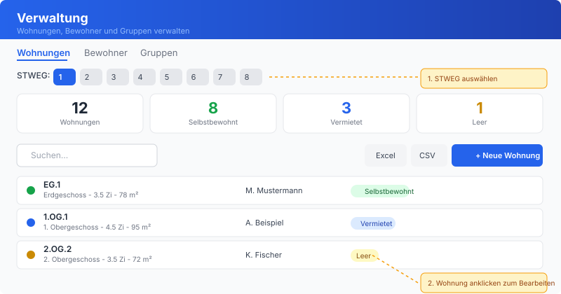
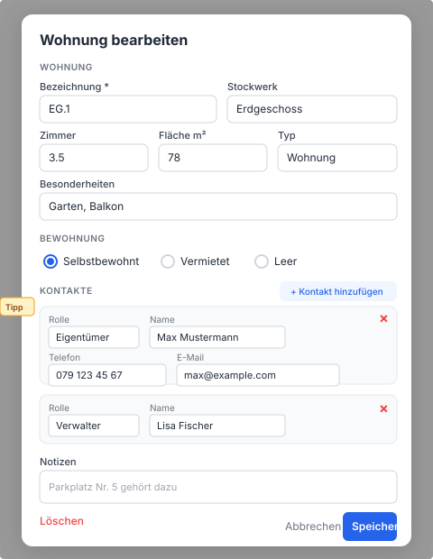
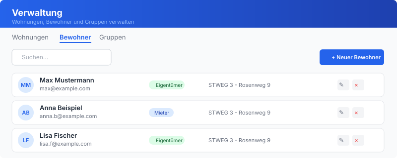

# Verwaltung - Anleitung Wohnungen anpassen

## Zugriff

Die Verwaltung ist erreichbar unter **rosenweg.net/verwaltung.html** (oder "Verwaltung" im Navigations-Menu).

### Berechtigungen

| Rolle | Zugriff |
|-------|---------|
| **Technik** | Alle STWEGs, alle Tabs (Wohnungen, Bewohner, Gruppen) |
| **Ausschuss** | Nur eigene STWEG, Tabs Wohnungen und Bewohner |
| **Eigentümer** | Kein Zugriff auf die Verwaltung |

---

## Tab: Wohnungen

### STWEG auswählen

Oben werden die verfügbaren STWEGs als Buttons angezeigt. Klicke auf eine STWEG-Nummer um deren Wohnungen zu laden. Die Statistik-Leiste zeigt Gesamtzahl, Selbstbewohnt, Vermietet und Leer.

### Wohnung suchen

Nutze das Suchfeld oben links. Es durchsucht Bezeichnung, Eigentümer-Name und Stockwerk.

### Neue Wohnung anlegen

1. Klicke **"Neue Wohnung"** (blauer Button oben rechts)
2. Fülle die Felder aus (siehe Modal unten)
3. Klicke **"Speichern"**

### Wohnung bearbeiten

1. Klicke auf eine Wohnung in der Liste (oder das Stift-Symbol)
2. Ändere die gewünschten Felder
3. Klicke **"Speichern"**

### Wohnung löschen

1. Öffne die Wohnung zum Bearbeiten
2. Klicke unten links auf **"Löschen"** (rot)
3. Bestätige die Löschung

### Wohnungs-Modal (Bearbeiten / Neu)

**Felder im Detail:**

| Feld | Beschreibung | Beispiel |
|------|-------------|----------|
| **Bezeichnung** * | Eindeutige Kennung der Wohnung | `EG.1`, `1.OG.2`, `TG.3` |
| **Stockwerk** | Auswahl von Untergeschoss bis Dachgeschoss | Erdgeschoss |
| **Zimmer** | Anzahl Zimmer | `3.5` |
| **Fläche m²** | Wohnfläche in Quadratmetern | `78` |
| **Typ** | Art der Einheit | Wohnung, Hobbyraum, Tiefgarage-Platz, Parkplatz |
| **Besonderheiten** | Freitext für Extras | Garten, Balkon, Waschturm |
| **Bewohnung** | Aktueller Status | Selbstbewohnt, Vermietet, Leer |
| **Notizen** | Zusätzliche Informationen | Parkplatz Nr. 5 gehört dazu |

### Kontakte einer Wohnung

Jede Wohnung kann mehrere Kontakte haben (Eigentümer, Mieter, Verwalter).

**Kontakt hinzufügen:**
1. Im Wohnungs-Modal klicke **"+ Kontakt hinzufügen"**
2. Fülle aus:
   - **Rolle**: Eigentümer, Mieter oder Verwalter
   - **Name**: Vor- und Nachname
   - **Telefon**: Telefonnummer
   - **E-Mail**: E-Mail-Adresse
3. Pro Wohnung können mehrere Kontakte erfasst werden (z.B. zwei Eigentümer, oder Eigentümer + Verwalter)

> **Hinweis zur Rolle "Verwalter":** Diese Rolle ist nicht nur für professionelle Hausverwaltungen gedacht. Sie wird auch für Familienangehörige verwendet, die als Ansprechperson für ältere Eigentümer eingetragen werden (z.B. Kinder, die sich um die Angelegenheiten der Eltern kümmern).

**Kontakt entfernen:**
- Klicke das **"×"** neben dem Kontakt

### Daten exportieren

- **Excel**: Klicke "Excel" in der Toolbar - exportiert alle Wohnungen der gewählten STWEG als .xlsx
- **CSV**: Klicke "CSV" - exportiert als kommaseparierte Datei

### Daten importieren

Der "Import"-Button importiert Daten aus der bestehenden `kontakte.json` Datei der jeweiligen STWEG. Dies ist nützlich für die Erstbefüllung.

---

## Tab: Bewohner

Zeigt alle registrierten Benutzer (Authentik-Accounts) der gewählten STWEG.

### Neuen Bewohner anlegen

1. Klicke **"Neuer Bewohner"** (blauer Button oben rechts)
2. Fülle aus:
   - **Name** (Pflicht)
   - **E-Mail** (Pflicht) - damit meldet sich der Bewohner an
   - **Rolle**: Eigentümer oder Mieter
3. Klicke **"Speichern"**
4. Der Bewohner erhält automatisch einen Authentik-Account und wird den passenden Gruppen zugewiesen

### Bewohner bearbeiten

1. Klicke auf einen Bewohner in der Liste (Stift-Symbol)
2. Ändere Name, E-Mail oder Rolle
3. Klicke **"Speichern"**

---

## Tab: Gruppen

Nur für **Technik** sichtbar. Zeigt alle Authentik-Gruppen und deren Mitglieder. Hier können:
- Neue Gruppen erstellt werden
- Mitglieder zu Gruppen hinzugefügt/entfernt werden

---

## Typische Aufgaben

### Eigentümerwechsel

1. Öffne die betroffene Wohnung
2. Ändere den bestehenden Kontakt oder entferne ihn und füge den neuen Eigentümer hinzu
3. Speichern
4. Im Tab "Bewohner": Alten Bewohner deaktivieren, neuen anlegen

### Wohnung wird vermietet

1. Öffne die Wohnung
2. Ändere Status auf **"Vermietet"**
3. Füge einen neuen Kontakt mit Rolle **"Mieter"** hinzu
4. Speichern
5. Optional: Im Tab "Bewohner" den Mieter als neuen Benutzer anlegen

### Tiefgarage-Plätze / Hobbyräume erfassen

1. Klicke "Neue Wohnung"
2. Bei **Typ** wähle "Tiefgarage-Platz", "Parkplatz" oder "Hobbyraum"
3. Bei **Bezeichnung** z.B. `TG.5` oder `HR.2`
4. Eigentümer als Kontakt hinzufügen
5. Speichern
